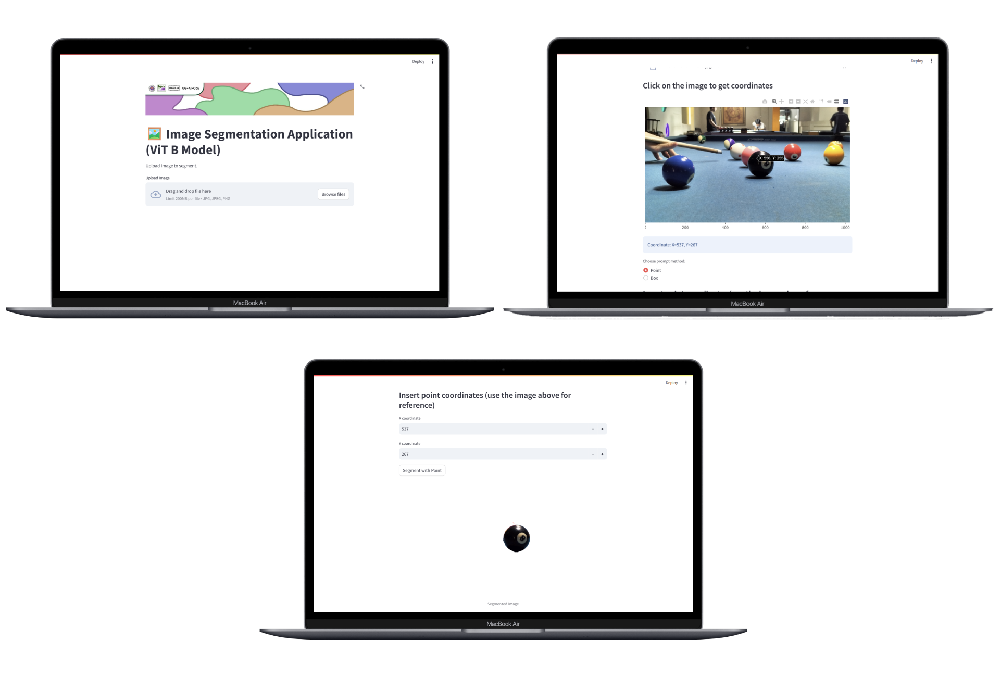

# 🖼️ Image Segmentation Application Using Segment Anything Model (SAM)



## 🔎 About
This project focuses on image segmentation using the Segment Anything Model (SAM), with points and bounding boxes as prompt encoders.

Project languages:
* en
  
## 📦 Dependencies
|  Name  |  Version  |
|--------|-----------|
|[streamlit](https://pypi.org/project/streamlit/)|1.32.2|
|[streamlit-plotly-events](https://pypi.org/project/streamlit-plotly-events/)|0.0.6|
|[numpy](https://pypi.org/project/numpy/)|1.26.4|
|[opencv-python](https://pypi.org/project/opencv-python/)|4.12.0.88|
|[pillow](https://pypi.org/project/pillow/)|10.4.0|
|[torch](https://pypi.org/project/torch/)|2.8.0+cu126|
|[plotly](https://pypi.org/project/plotly/)|6.3.0|
|[segment_anything](https://pypi.org/project/segment-anything/)|1.0|

## 🖥️ Requirements
* Operating System (OS): Windows 10, Mac, Linux.
* `python>=3.8`, `pytorch>=1.7` and `torchvision>=0.8`
* Integrated Development Environment (IDE): VSCode.
* Web Browser: Google Chrome, Microsoft Edge, Firefox, Safari.

## ⬇️ Installation
### Make a directory
```
mkdir img_segmentation_app
```
```
cd img_segmentation_app
```
### Create and activate environment
```
python -m venv venv
```
```
venv\Scripts\activate 
```
### Install dependencies
```
pip install --upgrade typing-extensions
```
for CUDA compute platform:
```
pip3 install torch torchvision --index-url https://download.pytorch.org/whl/cu126
```
for CPU only:
```
pip3 install torch torchvision
```
```
pip install git+https://github.com/facebookresearch/segment-anything.git
```
```
pip install streamlit==1.32.2 streamlit-drawable-canvas opencv-python pillow numpy matplotlib pycocotools onnxruntime onnx 
```
### Download model 
```
wget https://dl.fbaipublicfiles.com/segment_anything/sam_vit_b_01ec64.pth -O sam_vit_b.pth
```
### Clone Repository
```
git clone https://github.com/wicaksonohanif/image_segmentation_project.git
```
### Run App.
```
streamlit run app4.py
```

## 🥼 Author(s) / Contributor(s)
* Wicaksono Hanif Supriyanto

## 📚 References
* Kirillov, A., Mintun, E., Ravi, N., Mao, H., Rolland, C., Gustafson, L., Xiao, T., Whitehead, S., Berg, A. C., Lo, W.-Y., Dollár, P., & Girshick, R. (2023). Segment Anything. arXiv. https://arxiv.org/abs/2304.02643
